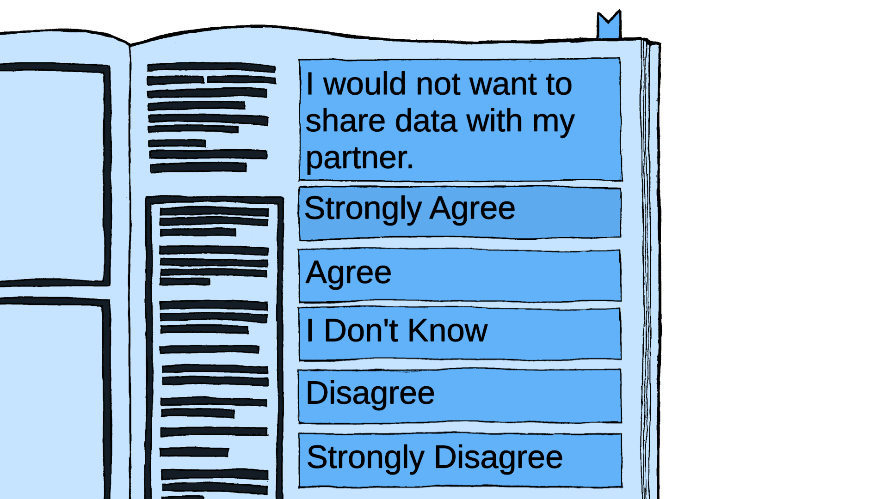
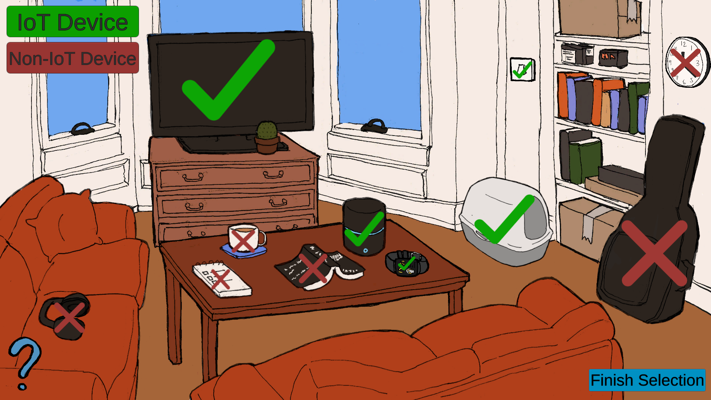
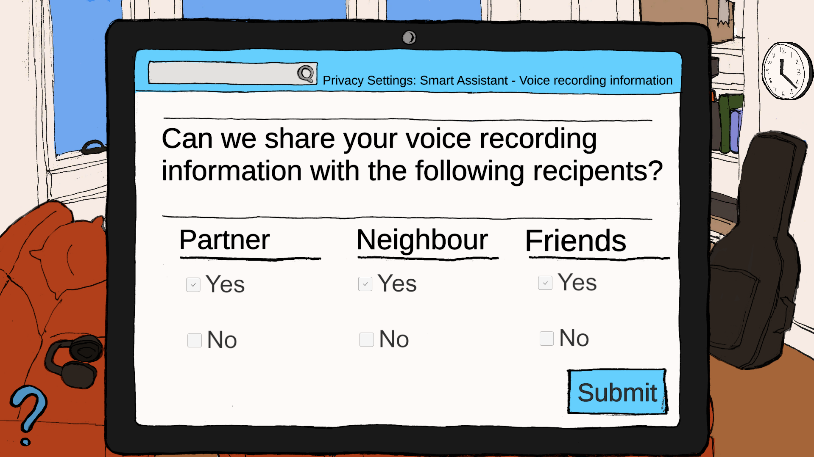

# MInf 2 Year Dissertation Project - Privacy Adventure Game

## Motivation
The project's aim was to explore people's understanding of their privacy preferences while using Internet of Things devices, and whether their actions were in line with what they imagined. 

## The Game
Players answer questions on what information they would be comfortable disclosing:
 

They then are asked to identify IoT devices in the home:

Afterwards they interact with IoT devices to decide what information to share:

At the end players are given feedback on their choices and whether they align with the answers given at the beginning.

## Development
The game was made in the Unity Engine and using C# scripting, with sprites designed for the game. 
